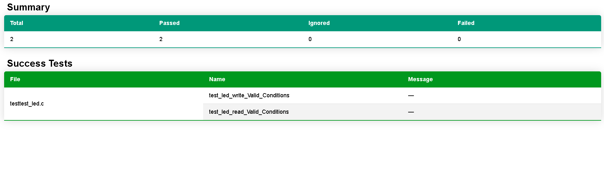
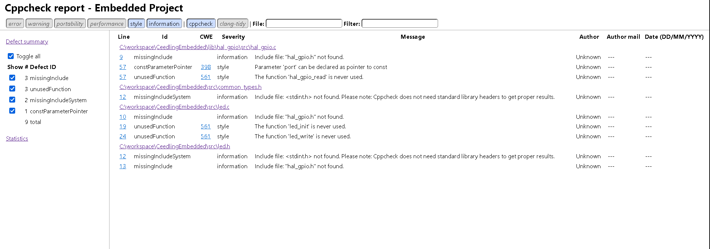

# CeedlingEmbedded
This repository will be help you quick start for embedded project unit testing. This project includes code beautifier, static analysis tool. You can generates code coverage reports, test reports and static analysis reports as html files. Also there are many helpful script files. 


# Contents 
- [CeedlingEmbedded](#ceedlingembedded)
- [Contents](#contents)
- [Introduction](#introduction)
- [Setup](#setup)
- [Usage](#usage)
- [Reports Images](#reports-images)


# Introduction

Unit test functions written with Ceedling. You can visit this [github page](https://github.com/ThrowTheSwitch/Ceedling) and you can learn information more about Ceedling. 

This project was created to test any microcontroller. There is called name as **lib**  folder that is you can add specific microcontroller library. Test source files are located under the **test** folder. Firmware files are located under the **src** folder.There are ruby files used by ceedling under the **plugins** folder.  Generated files are located under the **build** folder. There are script files under the **scripts** folder.  **code_beautifer.sh** formatting the all files according to configuration file that is **uncrustify.cfg**.

Ceedling can build project according to microcontroller compilers. However, since we wanted to test on the computer, we made arrangements for the GCC compiler. 

**Note:** I wanted to use VS Code IDE because there are many useful extensions and you can easily build your project .

# Setup

You have to have following dependencies. 

1. Ceedling build system  [Ceedling](http://www.throwtheswitch.org/ceedling)
2. GCC compiler  [gcc](https://code.visualstudio.com/docs/cpp/config-mingw)
3. Cppcheck static analysis tool  [Cppcheck](https://cppcheck.sourceforge.io/)
4. Uncrustify code beautifier  [Uncrustify](https://sourceforge.net/projects/uncrustify/)
5. Ruby 3.0.6-1 (x64) release downloaded. [Ruby](https://rubyinstaller.org/downloads/)
6. Python 3.11.4 release downloaded.  [Python](https://www.python.org/downloads/)
7. You should write following command  on your command prompt for html file convert. 
    ````
    pip install pip
    ````
    ````
    pip install Pygments
    ````
8. Gcovr code coverage (4.1 release)  [gcovr](https://pypi.org/project/gcovr/)

**NOTE:** Sometimes Python packages give errors when installed via the command line. Therefore, you can download manually to your computer with this [link](https://www.activestate.com/resources/quick-reads/how-to-manually-install-python-packages/). 

You should be sure all packages safely downloaded on your computer.

```
ceedling version
```
```
gcc --version
```

```
cppcheck --version
```
```
ruby --version
```
```
gcovr --version
```
```
uncrustify --version
```

# Usage

If you want to run unit test, you can go on your root of project and run following command.

```
ceedling test:all
```

You can define buttons and you can easily build your project. There task buttons defines with VS Code IDE extension who name is **spencerwmiles.vscode-task-buttons**.
Buton tanımlayarak testleri otomatik hale getirebilirsiniz. Bunun için VS Code IDE si kullanılarak çeşitli butonlar oluşturulmuştur. Bu butonların görülebilmesi için VS Code extension kısmından **spencerwmiles.vscode-task-buttons** isimli eklenti yüklenmelidir.

- **Test All** button ```ceedling test:all``` command run.
- **Re-Test All** button allows recompiling the code and running the tests by executing the ```ceedling clobber``` and ```ceedling test:all``` commands sequentially.
- **Cleand build** button is used to delete the output files created under the **build** folder by running the ``ceedling clobber``` command.
- **Code Beautifier** button is used to edit software codes by running the ```./code_beautifier.sh``` command. 
- **Report HTML** button generates code coverage report of test files by running ``ceedling gcov:all utils:gcov ``` commands.
- **cppcheck** button performs static analysis of the code by running the ```./html-report-stats/static_run.sh ``` command.
- **Test Result Open** button allows us to see the test results by running the ```start GcovCoverageResults.html```, ```start stats.html``` and ```start report.html``` commands sequentially.

# Reports Images

**Code Coverage Reports**



